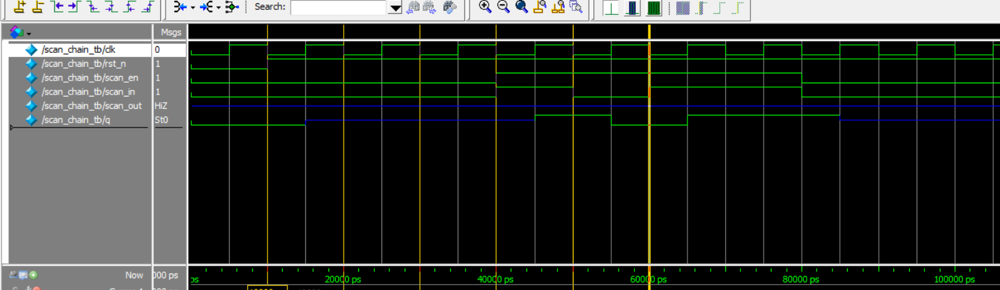

# Verilog Scan Chain Project

This project implements a **3-stage scan chain** using Verilog HDL.  
It includes RTL design, testbench for simulation, and waveform verification.

---

## 📁 Files Overview

| File Name             | Description                                |
|:----------------------|:-------------------------------------------|
| `scan_chain.v`         | Top module integrating 3 scan DFFs         |
| `scan_dff.v`           | Single scan-enabled D flip-flop            |
| `scan_chain_tb.v`      | Testbench to verify scan operation         |
| `RTL_scan_chain_tb.PDF`| RTL schematic diagram (generated by Quartus) |
| `wave_scan_chain_tb.png`| Waveform screenshot (captured by ModelSim) |
| `monitor_log.txt`      | Simulation expected result (template)      |

---

## 🧩 RTL Diagram

📜 [Click here to view RTL Diagram](RTL_scan_chain_tb.PDF)

---

## 🖥️ Simulation Waveform

Here is the captured waveform showing correct scan shifting behavior:



---

``` 
===== Scan Chain Simulation Result =====

- Time: 0ns  
  ➔ Reset active (rst_n = 0)

- Time: 10ns  
  ➔ Reset released (rst_n = 1)

- Time: 20ns  
  ➔ Scan mode enabled (scan_en = 1)

- Time: 20ns  
  ➔ Scan_in = 1 shifted in

- Time: 30ns  
  ➔ Scan_in = 0 shifted in

- Time: 40ns  
  ➔ Scan_in = 1 shifted in

- Time: 50ns  
  ➔ Scan_in = 1 shifted in

- Time: 60ns  
  ➔ Scan mode disabled (scan_en = 0)

---

Final output:

- q[2:0] = 3'b110
- scan_out = 1
```
---

## 🛠️ Tools Used

- **Quartus Prime Lite Edition** (for RTL schematic generation)
- **ModelSim Intel FPGA Starter Edition** (for waveform simulation)
